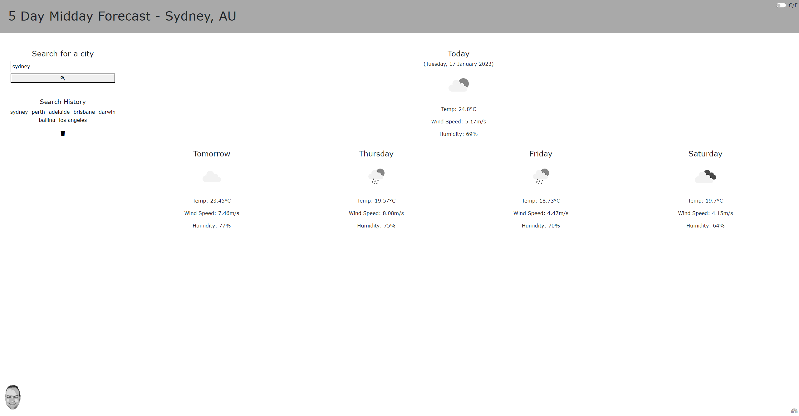

# Weather Forecast (Week-06-homework)

## Live Website

The website can be accessed via either of these two URLs;

- https://aaronqwerty.github.io/weather-forecast
- http://weather.raikes.com.au/index.html

## Description

Week six homework required me to create a weather app which will show the current weather for a city and the expected weather for the next 4 days. The website should store the cities which have been searched so they can be clicked on and searched again.

This project includes;

- html
- JavaScript
- CSS

For this project I had to do a lot of reverse engineering and googling to better understand what we had learned this week, since there was a lot. The Web API's were exciting to learn as they started to add 'magic' to our website.

I to make the app more fun, I have added a small rainbow in the bottom right corner (when the screen is larger than 840px), clicking on this well enable/disable a color from the rainbow. I also added the option for users to select if they would like their weather discplayed in metric (celcius) or imperial (fahrenheit).

## Installation

There are no steps to install this project, simply open the deployed website and enjoy.

## Usage

The webpage should resize automatically based on the screen size.

## Screenshot

